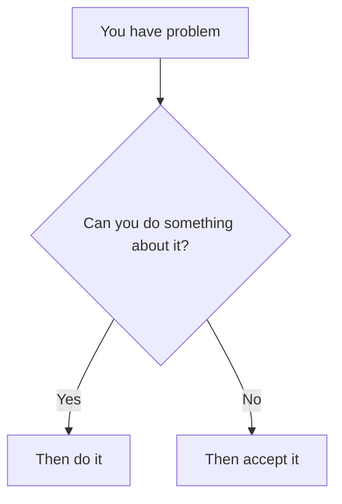

# Twilight-To-Power
Kukuku.. let us get straight to the point, this is a guide on how to ascend above the average for those whom are hungry for knowledge, however the topics we'll be teaching can transfer to different areas, so if you're interested in cognitive growth, knowledge and power, this guide will serve you good
## Table of contents
- [Introduction](#introduction)
  - [Test](#disclaimer)
  - [Test](#test)
- [Test](#test)
## Introduction
This guide has been written by Takaso and Loja (Komodo), but before we proceed to learning techniques, skills, etcetera; we must master our own mind first, which is why the beginning will be decided to topics such as metacognition, emotional control, and how to trick yourself into discipline, so now, let us begin
# Disclaimer
We are not professionals, so our information is result of personal research, there is the possibility of accurate information, but most of the material presented is tested, you can open an issue to let us know what we got wrong 
## Discipline
Here we'll be breaking down every methods to attain discipline, so with it you can stay committed to your training without getting distracted
# Create your environment
The quickest method is changing your environment, if you have all distractions nearby your brain will look for ways to escape, but how do we begin?
###### Modify your devices
* To begin, I generally advise to delete TikTok, or any short form app, maybe installing a blocker, short form content is the mind killer (Here let's list academic proofs) + add more advice
* Item 2
* Item 2a
* Item 2b
    * Item 3a
    * Item 3b

(Poi diciamo anche come avere un'altra persona a monitorarti è oscuro, ecc.)

 - - - - - - - - - - - - - - - - Stuff I'll add in the future:

## Emotional control
There is a basic formula to dealing with your problems, here is a graph to show it:

Tell yourself this whenever you feel stressed about something, because truth is not what you want it to be, it is what it is, and you must bend to its power, or live a lie, being invested emotionally into a problem which cannot be solved is a waste of mental energy, and if you can do something about it, then work on solving it instead of complaining
