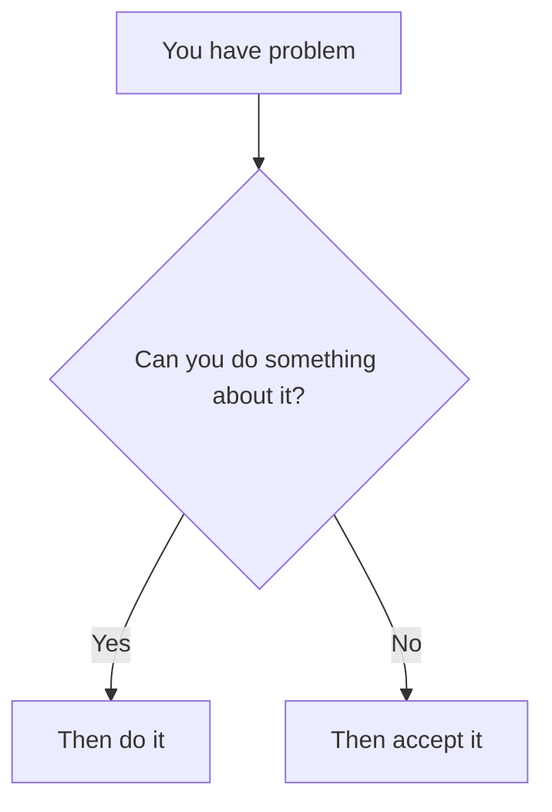

# Twilight To Power

Written by Takaso and Komodo, a guide on ascension

---

## Table of contents

* [Introduction](#introduction)
* [Disclaimer](#disclaimer)
* [Part I — Mastering the Mind](#part-i--mastering-the-mind)

  * [Chapter 1 — Discipline](#chapter-1--discipline)

    * [Create your environment](#create-your-environment)

      * [Modify your devices](#modify-your-devices)
      * [External accountability](#external-accountability)
* [Future chapters](#future-chapters)

  * [Chapter 2 — Emotional control](#chapter-2--emotional-control)

---

## Introduction

Greetings.

If you are here, then you likely already desire knowledge, intelligence and power; if you do not, quit the guide right now.

Even if you are reading only out of curiosity, understand this clearly: This book was created for a selected few, those who possess the hunger and drive necessary to ascend beyond their current limitations.

I am here to help you actualize your potential without wasting your time.

You want to become better, yet desire alone has never been enough, you know that well.

You may possess potential, but potential that is never actualized is worthless.

Until your actions prove otherwise, your ambition is nothing more than imagination, which is why my job is to help you make your hidden potential into reality.

This guide was written by Takaso and Loja, also known as Komodo, before we proceed to learning techniques, cognitive skills and the pursuit of knowledge, we must first master the mind responsible for using them, fufu..

There is no value in possessing the perfect learning method if you cannot force yourself to practise it, don't you think? For this reason, the beginning of this guide will be dedicated to the foundations of ascension: discipline, metacognition, emotional control and the methods through which you can make your own mind obey you, it is time for you to take back what is yours, you will not live your slave as a slave to your laziness and impulses

Most people desire power, it's easy to wish to become better, but only few are willing to actually take action in order to gain it and persist under such a path,

Now,
we will discover which one you are.

Kukuku... let us begin.

---

## Disclaimer

We are not professionals, so our information is the result of personal research, there is the possibility of low accuracy information, but most of the material presented is personally tested, you can open an issue to let us know what we got wrong

We will attempt to provide sources to the topics which will be mentioned ahead, some of the language is rethorical and not every things are to be taken literally, do not take the ideas presented to the extremes or it will result in burnout

We have zero responsibility on the way you will be going to use the knowledge provided

---

# Part I — Mastering the Mind

---

## Chapter 1 — Discipline

Here we'll be breaking down every method to attain discipline, so with it you can stay committed to your training without getting distracted, my goal is to make you addicted to knowledge, give you the same passions I have for rising above, together we shall thrive to new heights, that's why having a system for it is fundamental, fufu..

### Chapter objective

By the end of this chapter, you should have:

* Removed or limited your main distractions
* Created a dedicated training environment
* Established a minimum daily commitment
* Created a method for tracking your behaviour
* Created a recovery procedure for failed days, since will power isn't infinite

---

### Create your environment

The quickest method is changing your environment, if you have all distractions nearby your brain will look for ways to escape, but how do we begin?

Before changing anything, list:

| Area               | Main distraction | When it appears | Change to make |
| ------------------ | ---------------- | --------------- | -------------- |
| Phone              |                  |                 |                |
| Computer           |                  |                 |                |
| Bedroom            |                  |                 |                |
| Study area         |                  |                 |                |
| Social environment |                  |                 |                |

After completing the table, choose only the three changes with the greatest expected impact, this is the lowest starting commitment I'm asking from you, if you're not ready to make sacrifices, then you can only dream of ascending above, you must go to places others aren't willing to explore, or else you will stay average, but if you're not willing to give up anything, then you should leave this guide in this instant, it is not for you, stay part of the herd

---

### Modify your devices

* To begin, I generally advise deleting TikTok and other short-form content apps, if you still need those apps to communicate with people, consider installing an app blocker or restricting their use to specific times, you must apply this new law into your mind: **Short-form content is the mind killer**: a [systematic review and meta-analysis of 71 studies involving 98,299 participants](https://pubmed.ncbi.nlm.nih.gov/41231585/) associated heavier short-form video use with worsened attention and inhibitory control, while a [controlled experiment on rapid context switching](https://arxiv.org/abs/2302.03714) found that watching short-form videos could impair the ability to remember and carry out intended actions as they quote, the same way you don't want to eat unhealthy food, you must not feed slop into your mind
* Item 2
* Item 2a
* Item 2b

  * Item 3a
  * Item 3b

---

### External accountability

(Poi diciamo anche come avere un'altra persona a monitorarti è oscuro, ecc.)

---

### Minimum commitment

Introduce a daily minimum that is too small to negotiate away, this principle in psychology allows you to do many difficult tasks against your will when you feel too lazy to even begin, for instance, if you tell yourself: "I'll go to the gym just for 10 minutes, only that", a task that is easy to do and requires no effort, you'll have the will to begin, but once you're there, it suddenly feels easy, and you can even go further than the 10 minutes originally planned, allowing you to stay for an entire hour

Examples you could use:

* Read one page
* Solve one math problem
* Train for five minutes
* Write one paragraph

They're all tasks that are effortless, negotiate with yourself like this and you'll become a machine that can do anything 

---

### Failure and recovery rules

1. Do not attempt to compensate through extreme work, start small but be consistent
2. Record exactly what caused the failure in order to avoid it in the future
3. Modify the environment responsible for it
4. Complete the minimum commitment immediately, no "I'll do it later"

You must follow basic rules, because even one day of rest will make you resume into your pitiful life of comfort and laziness, even doing the bare mininum is okay, you must mantain consistency, puhuhu..
You will not run of the kind of cheap of motivation you get at the beginning of every year, you'll exploit your own neurology to your needs

---

### Chapter review

1. What is your greatest recurring distraction?
2. What environmental change will remove it?
3. What is your minimum daily commitment?
4. How will you track completion?
5. Who, if anyone, will hold you accountable?
6. What will you do immediately after a failed day?

You need to know yourself to adjust yourself, answer these with honesty, think about it for a moment before answering

---

### Chapter challenge

Your first challenge is the following: stare at a wall for 20 minutes, no phone, no music, only staring, you and your mind
If you quit before the time runs out, then your attention span is doomed; with the exception of ADHD and other conditions, of course
You must delete YouTube or any app you have entirely and suffer from a disease named “boredom”; however, if you manage to complete it, then fufu... congrats, there is still hope for your attention

During the session, you will notice many thoughts arising in your mind, when external stimulation is reduced, the brain commonly shifts toward internally generated thought, including autobiographical memories, future planning and spontaneous associations, processes associated with the brain's [default mode network](https://pubmed.ncbi.nlm.nih.gov/24502540/)
You are connecting thoughts, and periods of [quiet wakeful rest may support memory consolidation](https://pubmed.ncbi.nlm.nih.gov/40087245/) by reducing interference from new information which you usually get all the time by staying distracted

This exercise works like a reset, well, not as a literal neurological reset, but as a temporary break from constant stimulation, remaining with a monotonous activity may also show you how strongly you feel the need to seek stimulation, this will be perfect to rest your current limitations

Next, for seven days:

* Follow one fixed minimum commitment, one thing you must do daily
* Keep the principal distracting application blocked, not even using it for just a minute
* Record every failed session if there are some
* Change one environmental factor whenever the same failure occurs twice

---

# Future chapters (Ignore this for now)

Stuff I'll add in the future:

## Part I — Mastering the Mind

* Chapter 1 — Discipline (mid cingulate anterior cortex type of stuff)
* Chapter 2 — Emotional control
* Chapter 3 — Metacognition
* Chapter 4 — Attention control

## Part II — Learning and Knowledge

* Chapter 5 — Learning how to learn
* Chapter 6 — Memory systems
* Chapter 7 — Reading and information processing
* Chapter 8 — Building broad knowledge

## Part III — Cognitive Power

* Chapter 9 — Logic and reasoning
* Chapter 10 — Mental calculation
* Chapter 11 — Probability and decision-making
* Chapter 12 — Strategic thinking

## Part IV — Application

* Chapter 13 — Communication
* Chapter 14 — Observation
* Chapter 15 — Problem-solving
* Chapter 16 — Creating a lifelong training system

---

## Chapter 2 — Emotional control

My, my.. emotional control, the ability almost everybody believes they possess, until they face real struggle, anybody can remain calm when everything goes according to plan, it's no diff

But your control is revealed when you fail, lose something important, get rejected, feel insulted or face a problem you cannot immediately solve, when you have every reasons to go crazy

But do not misunderstand since some of you always jump to conclusions, emotional control does not mean becoming emotionless, emotions are information: Fear warns you, anger reveals resistance, sadness marks loss and anxiety prepares you for uncertainty, the problem begins when you stop using your emotions and allow them to use you; think about it for a moment, the pain you feel is not part of you, it's your brain producing a feeling, it's neither good or bad, it just is

But without getting lost into explanations, let us get straight into it right away, here is a basic formula to dealing with your problems, these are the absolute basics:

Tell yourself this whenever you feel stressed about something, because truth is not what you want it to be, it is what it is, and you must bend to its power, or live a lie. Being invested emotionally into a problem which cannot be solved is a waste of mental energy, and if you can do something about it, then work on solving it instead of complaining

| Category       | Question                             |
| -------------- | ------------------------------------ |
| Facts          | What objectively happened?           |
| Interpretation | What meaning am I adding?            |
| Control        | Which parts can I influence?         |
| Action         | What can I do next?                  |
| Acceptance     | What must remain outside my control? |

You not most react impulsively, you will respond with intention, ask yourself these emotions before going into an emotional rush, whenever you struggle emotively over something, imagine a friend is coming to you for advice, you shall do what you'd tell them to in that situation

